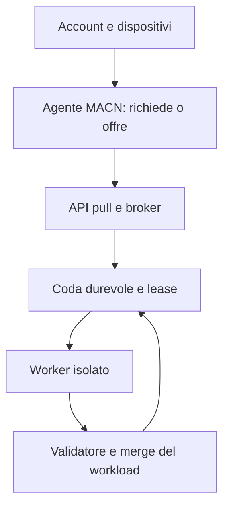

# MACN — Visione e roadmap

## Missione

MACN vuole rendere accessibile, senza pagamenti obbligatori, la capacità di calcolo volontaria di computer diversi. Un partecipante deve poter offrire le risorse libere dei propri dispositivi e, quando ne ha bisogno, chiedere alla rete di elaborare un proprio lavoro. Lo stesso account potrà quindi avere dispositivi che forniscono calcolo e job che lo richiedono, anche nello stesso momento.

La priorità è il calcolo **asincrono**: ogni nodo riceve lavoro indipendente, lo svolge nei tempi e nei limiti scelti dal proprietario, e restituisce il risultato quando può. Un job può durare ore o giorni. MACN è adatto soprattutto a problemi divisibili con pochi scambi di dati; non sostituisce automaticamente una GPU per calcoli strettamente accoppiati, sensibili alla latenza o con grandi trasferimenti.

## Cosa impariamo da BOINC

BOINC separa progetti, host volontari e client. È il client a contattare periodicamente il server, chiedere una quantità di lavoro, inviare i risultati completati e descrivere le risorse dell'host. Questo modello pull consente ai nodi di stare dietro firewall e di essere collegati solo quando disponibili. Il server valuta anche se il lavoro è adatto all'host e se è plausibile completarlo entro la scadenza.

I volontari possono essere intermittenti, guasti o non fidati. BOINC tratta retry e validazione come parti del sistema: per workload che lo richiedono crea più istanze di un task, confronta i risultati e accetta un quorum secondo regole specifiche dell'applicazione. I crediti sono associati a risultati validati. Sono principi utili per MACN, non una richiesta di copiare l'intero stack BOINC. Riferimento: [architettura e modello di scheduling BOINC](https://boinc.berkeley.edu/boinc_papers/locality/text.php).

## Cosa impariamo da Golem

Golem distingue il **Requestor**, che formula un job e lo suddivide, dai **Provider**, che offrono risorse e svolgono i task. La documentazione descrive un agente Requestor collegato via API al servizio locale Yagna e un ambiente applicativo controllato sui provider; i job possono essere divisi in task paralleli. È una buona separazione dei ruoli da cui partire per account, dispositivi e richieste di calcolo: [architettura Requestor](https://docs.golem.network/docs/golem/overview/requestor) e [ruolo Provider](https://docs.golem.network/docs/providers).

Golem usa anche pagamenti con token GLM e costi di rete. MACN **non** adotta questo modello economico: da Golem prendiamo come riferimento i ruoli e il flusso di negoziazione/esecuzione, non token o pagamenti. Fonte: [meccanismi di pagamento Golem](https://docs.golem.network/docs/golem/payments).

## Principi originali di MACN

- Gratuito per chi chiede e per chi contribuisce; niente blockchain o criptovalute.
- Ogni utente può essere richiedente e fornitore, tramite uno o più dispositivi.
- Crediti interni come misura di contributi **utili e verificati**, per quote e priorità; non denaro e non requisito per accedere.
- Una quota iniziale gratuita per chi non ha ancora contribuito.
- Niente equivalenze arbitrarie tra un'ora di CPU, un'ora di GPU e un'altra classe di lavoro. I crediti dovranno basarsi su unità di lavoro definite dal workload, validate e calibrate contro una baseline pubblica. Un'unità di un workload non è automaticamente equivalente a un'unità di un altro.
- Prima affidabilità e controllo delle risorse; la decentralizzazione P2P è un obiettivo futuro, non una proprietà dell'attuale prototipo.

## Architettura proposta

La prima rete condivisa dovrebbe usare un **broker centrale** con API pull e database durevole. Semplifica autenticazione, quote, monitoraggio e recupero; non richiede connessioni permanenti dai worker. Gli adapter del workload devono isolare trasporto e scheduler dal calcolo specifico.

Contratto previsto per ogni workload: versione e input immutabili; suddivisione in task; requisiti di CPU/memoria/banda; funzione di calcolo; validatore; funzione di merge; regole di retry e verifica. Il broker distingue task assegnati, risultati ricevuti, risultati validati e risultati accettati. I dati voluminosi potranno essere serviti da storage separato solo quando le misure lo giustificheranno.

## Stato del repository

| Componente | Già presente | Limiti attuali |
|---|---|---|
| Adaptive | Scheduler adattivo, metriche e recupero tramite WebSocket; esperimenti WebRTC/ComputeRTC conservati | Modalità distinta dal Batch; non è la base per milioni di connessioni |
| Batch API | API HTTP pull per job, task, risultati e rinnovo lease | Token bearer condiviso; nessun account o quota per utente |
| Coda | SQLite con task persistenti, scadenza, rinnovo, retry limitato, fencing tramite token e accettazione una sola volta | Un coordinatore e un database SQLite; niente failover distribuito |
| Worker | CLI Node, benchmark locale, thread di calcolo, richieste pull e spool SQLite dei risultati | Non c'è ancora il worker browser/mobile Batch né un gestore completo dei limiti volontari |
| Workload | Monte Carlo deterministico con validazione della forma del risultato e merge | Il coordinatore non ricalcola il risultato: la forma valida non prova che il calcolo sia corretto |
| Simulazioni | Simulatori con code/task reali e tempo virtuale; carichi di nodi simulati | Non sono dispositivi fisici, Internet, né richieste concorrenti salvo il probe HTTP locale |
| Verifica | Fencing, deduplicazione e test di confronto con baseline | Nessun quorum configurabile, verifica indipendente o contabilità di crediti |
| Sicurezza | Segreto condiviso per la demo | Mancano identità/ruoli, TLS e isolamento del codice: non aprire a volontari pubblici |

Il benchmark espone due unità esplicite per compatibilità: `rate` è unità/ms per lo scheduler Adaptive storico; `unitsPerSecond` è unità/s per Batch. Worker, dimensionamento dei pacchetti, lease e EWMA Batch devono usare quest'ultima. Nel campione baseline, 250.000 campioni in 1,670 ms producevano `rate ≈ 149.686` unità/ms, ma il Batch li trattava come 149.686 unità/s invece di circa 149,7 milioni unità/s. Il limite di 32 task mascherava l'errore con alcuni chunk piccoli; chunk più grandi potevano ricevere meno lavoro e stime di lease eccessivamente prudenti. Il worker è in Node.js; un telefono può partecipare solo se può eseguire Node in questa alpha, non tramite una normale scheda browser.

## Fase A — Consolidamento e affidabilità

La branch di questa fase corregge il passaggio del benchmark al Batch, aggiunge test su conversione, pacchetti veloci/lenti, lease e aggiornamento adattivo, e prova che un risultato già accettato sopravviva al riavvio senza essere contato due volte. Il dimensionamento resta limitato a 32 task per pull; le lease sono stimate dal tempo previsto e rinnovate mentre il worker lavora. Le scadenze e i retry già esistenti restano invariati.

### Risultati registrati

Baseline su Alpha.3, prima delle modifiche: **60/60** test automatici superati. Prova HTTP locale singola con 64 client e 10.000 richieste: 2.898,5 richieste/s, p50 18,345 ms, p95 28,215 ms, p99 36,311 ms; tutti i 2.000 task richiesti furono allocati senza errori. Dopo la correzione: **64/64** test; la ripetizione HTTP ha dato 2.906,6 richieste/s, p50 17,773 ms, p95 29,736 ms, p99 38,794 ms, senza errori e con 2.000 task allocati.

I due probe HTTP sono una misura per run su loopback e SQLite in memoria. La differenza è compatibile con normale variabilità e **non dimostra un miglioramento di prestazioni**; non misura il calcolo dei worker né una rete di dispositivi. La simulazione Alpha.4 stabile continua a restituire il risultato Monte Carlo esatto: 1,25 s virtuali contro 1,50 s del nodo simulato più veloce (1,20×). Nello scenario di interruzione il task viene riassegnato e il risultato è esatto, ma il job richiede 3,03 s virtuali contro 1,00 s del nodo veloce (0,33×). Sono risultati del modello virtuale, non tempi fisici.

Suite browser locale: non eseguita perché Chromium mancava e il download Playwright è fallito con archivio incompleto nell'ambiente di sviluppo. La CI GitHub è il controllo finale del test browser. Il test autonomo del protocollo ComputeRTC v0.5.2 passa.

## Roadmap — fasi successive, solo progettate

### Fase B — Verifica del risultato

Definire policy per workload: controlli deterministici o proprietà matematiche quando possibili; ricalcolo a campione per lavori semplici; doppia esecuzione/quorum solo quando il rischio giustifica il costo; rilevamento di risposte incoerenti. Conservare stati separati per ricevuto, validato e accettato. Non pagare crediti per risultati non validati. Isolare il workload prima di ammettere codice di terzi.

### Fase C — Reciprocità e crediti

Introdurre identità utente separate da dispositivi, proprietario e coda multiutente, quote gratuite iniziali e limiti per evitare monopolio. Registrare i crediti solo dopo la validazione, con regole versionate per ciascun workload e un tetto per evitare abusi. Prima broker centrale con ruoli Requestor/Provider; niente P2P richiesto per questa fase.

### Fase D — Scalabilità misurata

Procedere per gradini 100, 1.000, 10.000, 100.000 nodi simulati e poi testare worker HTTP concorrenti su più processi/host. Registrare richieste/s, task utili/s, memoria, CPU, I/O, latenza p50/p95/p99 e tempo di recupero. Distinguere sempre nodi registrati, attivi e richieste simultanee. Passare da SQLite a PostgreSQL, separare dati o aggiungere coordinatori solo quando una prova ripetibile mostra un limite concreto.

### Fase E — Tre dispositivi reali

In una LAN privata protetta: un nodo richiede un job, due worker eterogenei lo ricevono via pull; spegnere deliberatamente un worker; aspettare scadenza/riassegnazione; confrontare risultato e copertura con il calcolo sequenziale. Registrare modello, sistema operativo, versioni, rate, tempi, rete e condizioni energetiche. Non esporre API non protette su Internet.

## Rischi e prerequisiti per una rete pubblica gratuita

- **Correttezza e attacchi:** il token condiviso non identifica utenti e il server non può sapere se un worker ha davvero eseguito il calcolo. Servono autenticazione, rate limiting, validazione workload-specifica e difese da Sybil/duplicati prima di assegnare crediti.
- **Codice ostile:** il worker non deve eseguire script arbitrari di richiedenti. Servono immagini/versioni firmate, sandbox a privilegi minimi, quote CPU/memoria/banda/disco e politica di rete in uscita.
- **Disponibilità:** un lease lungo protegge da falsi timeout ma rallenta il recupero; uno corto aumenta lavoro duplicato. La misura e la variabilità per dispositivo devono guidare scadenze, rinnovi e backoff.
- **Database e coordinamento:** SQLite è una scelta valida per alpha su singolo host, non una garanzia di milioni di nodi. Coda distribuita, coordinatori multipli e storage oggetti sono decisioni da misurare.
- **Trasferimento dati e workload:** task piccoli riducono il lavoro perso ma aumentano richieste; task grandi riducono overhead ma allungano i tempi di recupero. I job data-heavy possono essere limitati dalla rete e dallo storage, non dalla CPU.
- **Crediti:** una metrica universale di lavoro non esiste per workload diversi. Il credito dovrà rendere esplicita l'unità di lavoro e la verifica; non promettere un rapporto GPU/CPU universale.
- **Sostenibilità gratuita:** distinguere servizio gratuito da costi reali di hosting, traffico, storage, abuso e moderazione; mantenere quote e limiti che il progetto può sostenere.

La regola di rilascio è semplice: prima un alpha privato e ripetibile su macchine fidate; poi verifiche e identità; infine un invito ristretto e osservabile. La rete volontaria pubblica viene dopo, non prima, di isolamento e protezione dei dati.
