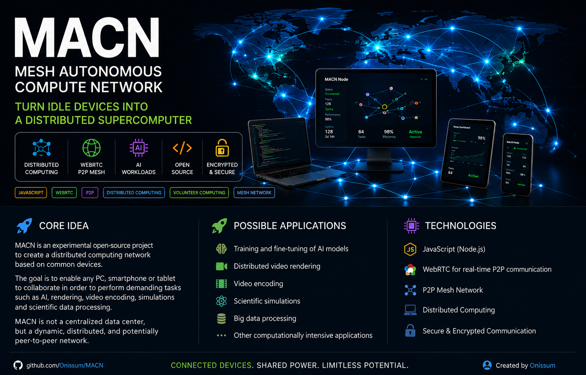

  

# MACN - Mesh Autonomous Compute Network

MACN è un progetto sperimentale per creare una rete distribuita di calcolo tra dispositivi comuni.

L'obiettivo è permettere a più dispositivi — PC, smartphone e tablet — di collaborare per eseguire compiti pesanti come AI, rendering, encoding video, simulazioni ed elaborazioni scientifiche.

## Idea centrale

Chi richiede potenza per un determinato compito diventa il coordinatore di quel job.

Gli altri dispositivi partecipano come worker volontari.

MACN non nasce come data center centralizzato, ma come rete distribuita, dinamica e potenzialmente peer-to-peer.

## Primo esperimento

In una prima prova sono stati collegati contemporaneamente 7 dispositivi tramite WebRTC:

- 3 PC
- 3 smartphone
- 1 tablet

L'obiettivo era verificare la comunicazione tra dispositivi diversi all'interno di una rete distribuita.

## Possibili applicazioni

- addestramento o fine-tuning di modelli AI
- rendering video distribuito
- encoding video
- simulazioni
- elaborazioni scientifiche
- condivisione volontaria di potenza computazionale

## Visione

MACN vuole esplorare un modello simile allo spirito di SETI@home, ma più flessibile e adatto ai bisogni moderni.

L'idea è usare hardware già esistente invece di installare nuovi mini data center dedicati.

## Stato del progetto

Il progetto è in fase iniziale/sperimentale.

Questo repository nasce per documentare l'idea, gli esperimenti e le future implementazioni.

## Milestone 0 - Seven Device Test

MACN ha già avuto una prima prova sperimentale reale.

Sono stati collegati contemporaneamente 7 dispositivi tramite WebRTC:

- 3 PC
- 3 smartphone
- 1 tablet

Questa prova ha dimostrato la possibilità di creare una comunicazione distribuita tra dispositivi eterogenei.

## Roadmap iniziale

### v0.1 - Network test
- Comunicazione WebRTC tra più dispositivi
- Identificazione dei nodi
- Stato online/offline
- Test con dispositivi diversi

### v0.2 - Distributed task test
- Invio di piccoli task computazionali
- Esecuzione locale sui worker
- Restituzione del risultato al coordinatore
- Misurazione dei tempi

### v0.3 - Benchmark distribuito
- Divisione del lavoro tra nodi
- Calcolo del contributo di ogni dispositivo
- Gestione dei nodi lenti o disconnessi

### v0.4 - AI / rendering experiments
- Test con micro-task AI
- Test con rendering o encoding distribuito
- Studio di modelli di contributo volontario

## Historic Prototype v11

Durante la fase sperimentale di ottobre è stata sviluppata una versione avanzata del prototipo MACN:

**MACN v11.0 - Asymmetric Distribution for Active Work-Stealing**

Questa versione includeva già:

- comunicazione WebRTC tra peer
- distribuzione di task computazionali
- benchmark Mandelbrot
- stato dei peer in tempo reale
- help-offer / help-accept / help-decline
- cooperative work-stealing
- distribuzione asimmetrica del carico

La versione storica è conservata in:

`historic-prototypes/v11/`
